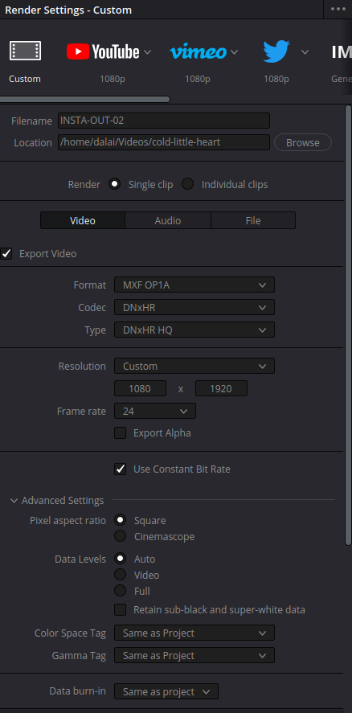

## 1. From POCOPHONE to Davinci Resolve 

from H.264 to PRORESS

```bash
ffmpeg -i INPUT.mp4 -c:a copy -c:v prores -profile:v 0 -pix_fmt yuv422p10 OUTPUT.mov
```

https://ottverse.com/ffmpeg-convert-to-apple-prores-422-4444-hq/
https://wideopenbokeh.com/AthenasFall/?p=111

## 2. Davinci Resolve Timeline
https://videowithjens.com/how-to-make-instagram-reels-in-davinci-resolve-full-guide/

## 3. Mixing in Resolve
Guitar and vocals:
https://www.youtube.com/watch?v=5-0aQGUiycY&t=126s

Compression:
https://www.youtube.com/watch?v=LAZ-bkK-AGw

## 4. Resolve Export
- Settings


## 5. Convert MXF to MOV
```bash
ffmpeg -i CINCO-OUT.mxf -pix_fmt yuv420p -c:v libx264 -c:a aac -b:a 384k -sn MXF-OUT.mov
```

## MXF to mp4
```bash
ffmpeg -i input.mfx -c:v libx264 -preset slow -crf 18 -c:a aac -b:a 256k output.mp4
```

## 6. Cut
```bash
ffmpeg -i INPUT.mov -ss 00:00:00 -to 00:40:00 OUTPUT.mov
```

# PNG to Video
### MP4
```bash
ffmpeg -framerate 24 -pattern_type glob -i '*.png' -c:v libx264 -pix_fmt yuv420p out.mp4
```

### PRORES
```bash
ffmpeg -framerate 24 -pattern_type glob -i '*.png' -c:v prores -profile:v 0 -pix_fmt yuv422p10 out.mov
```

### PRORES 4444
```bash
ffmpeg -framerate 24 -pattern_type glob -i '*.png' -c:v prores_ks -profile:v 4444 -pix_fmt yuva444p10 out.mov
```

### YouTube
```bash
ffmpeg -i in.mp4 -vf yadif,format=yuv420p -force_key_frames "expr:gte(t,n_forced/2)" -c:v libx264 -crf 18 -bf 2 -c:a aac -q:a 1 -ac 2 -ar 48000 -use_editlist 0 -movflags +faststart out.mp4
```

# Video to PNG
```bash
ffmpeg -i input.mp4 out-%4d.png
```

# Add Audio to Video
```bash
ffmpeg -i input.mp4 -i input.mp3 -c copy -map 0:v:0 -map 1:a:0 output.mp4
```

# Count frames
```bash
ffprobe -v error -select_streams v:0 -count_packets -show_entries stream=nb_read_packets -of csv=p=0 input.mp4
```

# Extract frames at certain fps
```bash
time for i in {0..39} ; do ffmpeg -accurate_seek -ss `echo $i*60.0 | bc` -i input.mp4 -frames:v 1 output-$i.png ; done
```
To change how mane frames extrac per second, modify it at: `echo $i*{fps} | bc`

# Image Manipulation
### Flip
```bash
ffmpeg -pattern_type glob -i '*.png' -filter:v hflip flipped/flipped-%3d.png
```
` 

### Rotate
```bash
ffmpeg -pattern_type glob -i '*.png' -vf transpose=2 rotate-%3d.png
```

# DeFlicker
### Video
```bash
ffmpeg -fflags +genpts -i NOFLICKER.mov -fflags +genpts -i NOFLICKER.mov -filter_complex "[0:v]setpts=PTS-STARTPTS[top]; [1:v]setpts=PTS-STARTPTS+.033/TB, format=yuv422p10, colorchannelmixer=aa=0.5[bottom]; [top][bottom]overlay=shortest=1" -c:v prores -profile:v 0 -pix_fmt yuv422p10 NOFLICKER-02.mov
```

### PNGs
```bash
ffmpeg -fflags +genpts -framerate 24 -pattern_type glob -i '*.png' -fflags +genpts -framerate 24 -pattern_type glob -i '*.png' -filter_complex "[0:v]setpts=PTS-STARTPTS[top]; [1:v]setpts=PTS-STARTPTS+.033/TB, format=yuv422p10, colorchannelmixer=aa=0.5[bottom]; [top][bottom]overlay=shortest=1" -c:v prores -profile:v 0 -pix_fmt yuv422p10 NOFLICKER-prores-24fps-01.mov
```
